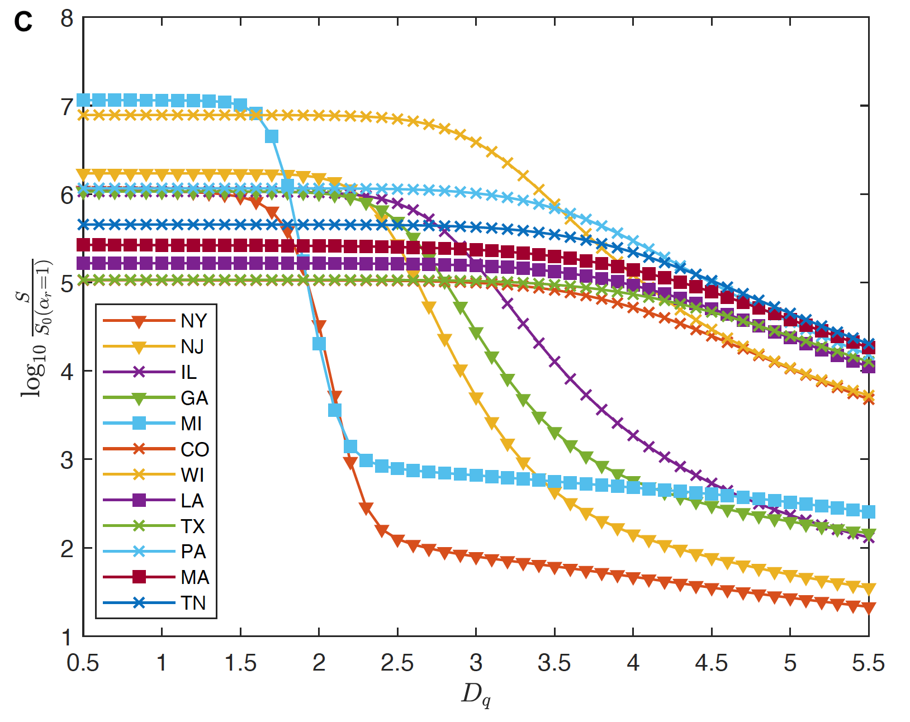

# Travel-Network-SEIR

### Code and Data
`./code/` contains the source codes: to run the travel flow-network SEIR-style ODE system for epidemic modeling.

`./data/` contains the data files to reproduce the model results. The Multiscale Dynamic Human Mobility Flow Dataset in the U.S. during the COVID-19 Pandemic can be found in our another open repository: https://github.com/GeoDS/COVID19USFlows

**Reference**: Shi Chen, Qin Li, Song Gao, Yuhao Kang, & Xun Shi (2020). State-specific Projection of COVID-19 Infection in the United States and Evaluation of Three Major Control Measures. *Scientific Reports* (in review), preprint available at https://scientific-reports-under-consideration.nature.com/posts/state-specific-projection-of-covid-19-infection-in-the-united-states-and-evaluation-of-three-major-control-measures.

### Abstract 
Most models of the COVID-19 pandemic in the United States do not consider geographic variation and spatial interaction. In this research, we developed a travel-network-based susceptible-exposed-infectious-removed (SEIR)  mathematical compartmental model system  that characterizes infections by state and incorporates inflows and outflows of interstate travelers. Modeling reveals that curbing interstate travel when the disease is already widespread will make little difference. Meanwhile, increased testing capacity (facilitating early identification of infected people and quick isolation) and strict social-distancing and self-quarantine rules are most effective in abating the outbreak. The modeling has also produced state-specific information. For example, for New York and Michigan, isolation of persons exposed to the virus needs to be imposed within 2 days to prevent a broad outbreak, whereas for other states this period can be 3.6 days. This model could be used to determine resources needed before safely lifting state policies on social distancing.

### An interactive map-based scenario simulation Web dashboard using the proposed model:
https://geods.geography.wisc.edu/covid19/us_model/

  

### The impacts of confirmed case reporting rate and quick isolation on susceptible population:

  

  

### Acknowledgements
We would like to thank SafeGraph (safegraph.com) for providing the anonymous and aggregated human mobility and place visit data. We would also like to thank all individuals and organizations for collecting and updating the COVID-19 epidemiological data and reports. Funding: S.G. and Q.L. acknowledge the funding support provided by the National Science Foundation (Award No. BCS-2027375). Q.L. and S.C. acknowledge the Data Science Initiative of UW-Madison. X.S. acknowledges the Scholarly Innovation and Advancement Awards of Dartmouth College. Any opinions, findings, and conclusions or recommendations expressed in this material are those of the author(s) and do not necessarily reflect the views of the National Science Foundation. 
